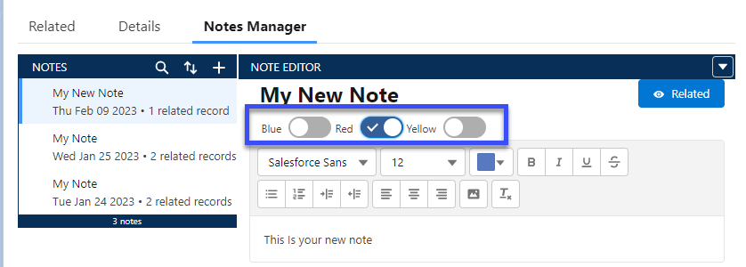
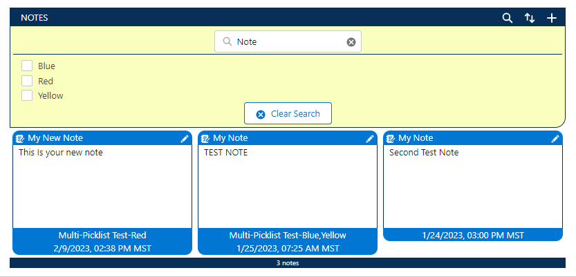
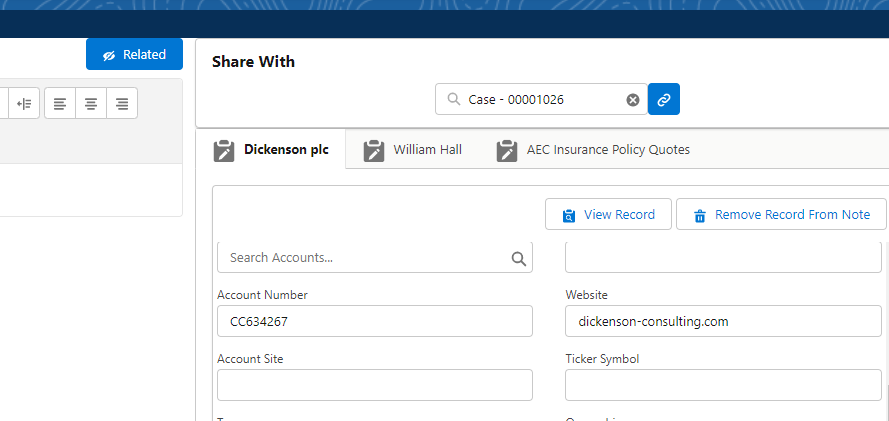

[Back To Home](index.md)

# Features

1. [Tag Your Notes for Easier Searching](#tagging-notes)
1. [Search Salesforce Notes](#search-notes)
1. [Connect Notes with Any Object In Your Org](#create-a-connection)

## Tagging Notes

Tag your Notes with helpful information to find them later.

## Search Notes

Search all of you Notes using text, title, or tags.

## Create a Connections

Link your Notes to any record in you Salesforce org.

